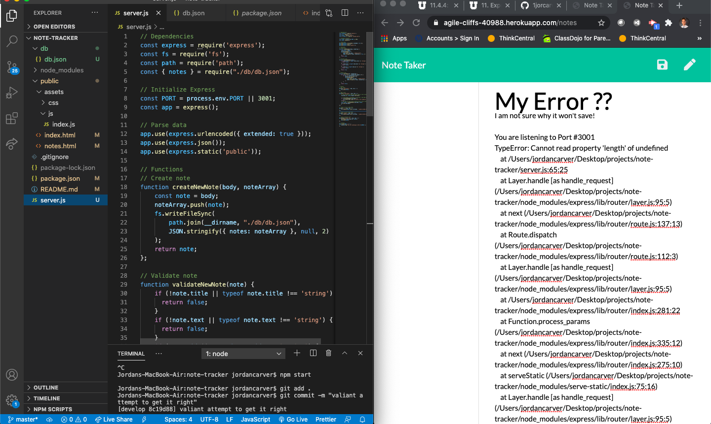

# Note-Tracker

## Description
This application, Note-Taker, used a front end starter code and Express.js back end to write and save notes. The two were connected and then deployed to Heroku.

## Table of Content
- [Description](##Description)
- [Installation](##Installation)
- [Back End Built With](##Built-With)
- [How to Use it](##Usage)
- [License](##License)
- [Questions](##Questions)

## Installation
The app used the following installations:
- Front end starter code: containing package.json, db.json, CSS, BootStrap, JQuery, and JavaScript
- NPM
- Node.js

## Back End Built With
- Node.js
- Javascipt
- NPM
- Heroku

## Usage
The follow images shows the finished product:

Heroku Live URL:
[Heroku](https://agile-cliffs-40988.herokuapp.com/notes)

## License

## Questions
* GitHub Username: 1jorcarver
* GitHub Profile: https://github.com/1jorcarver
* Email: jordan_carver@hotmail.com